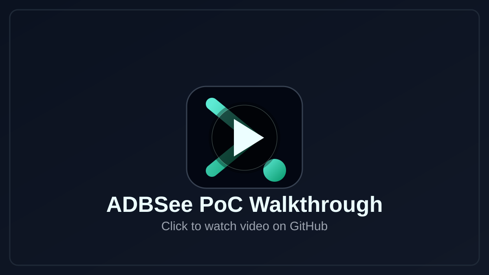

# ADBSee

ADBSee is a browser-native Android ADB workbench and a web wrapper for adb. It provides shell access, file exploration, screen control, app management, and advanced Android inspection from a single web app.

No host-side adb installation is required, and there is no native adb binary, local daemon, or backend proxy involved. Everything runs in the browser against your connected Android device over USB.

Built on top of Tango ADB (`@yume-chan/adb` and related packages).

<p align="center">
	
</p>

<p align="center">
	<a href="https://adbsee.shubhankargaur-xyz.workers.dev"><strong>Live Demo</strong></a>
	&nbsp;|&nbsp;
	<a href="https://github.com/user-attachments/assets/<After-Upload>"><strong>Watch PoC Video</strong></a>
</p>

## Live Demo

- Live app: https://adbsee.shubhankargaur-xyz.workers.dev
- PoC walkthrough video [Watch / Download](https://github.com/user-attachments/assets/<After-Upload>)

## PoC Video Preview

[](https://github.com/user-attachments/assets/<After-Upload>)


## Why ADBSee

ADBSee gives you a practical ADB workflow from a web page:

- Shell access
- File browser with upload/download/preview
- Live screen mirroring with input controls
- App manager with power-user workflows

All device interaction happens between your browser and phone via USB.

## Privacy And Security Model

- No server-side ADB proxy
- No analytics pipeline in this app
- No external API required for core features
- ADB keypair is stored locally in browser storage for reconnect convenience

Once the app is loaded, operations are local to browser + USB device.

## Feature Overview

### Connect

- WebUSB-based Android device pairing
- Reconnect to previously authorized devices
- Friendly failure handling for busy USB interfaces

### Shell

- Interactive terminal session
- Session recovery helpers
- Root shortcut support (when device permits)

### Files

- Browse, search, upload, download, rename, delete
- List/grid views and thumbnail rendering
- Inline preview for text, hex, and image data
- Root mode and run-as mode for advanced access
- Browse extracted Android backup contents as virtual FS

### Screen

- Live mirror stream with input forwarding
- Tap/swipe controls mapped to device coordinates
- Keyboard passthrough and clipboard paste
- Screenshot capture/download

### Apps

- Install/uninstall/force-stop/clear-data
- Pull installed APK and split APKs
- Component launch testing (activity/service/receiver/provider flows)
- Deep-link inspection and launch
- DEX-based extras key discovery
- Permission and runtime grant visibility
- Backup attempt/extraction workflow for assessment

## Requirements

- Chromium browser with WebUSB support (Chrome or Edge)
- HTTPS origin (or localhost during development)
- Android device with USB debugging enabled
- Data-capable USB cable

If connection fails because the interface is busy, stop other host-side USB/ADB consumers first.

## Having Issues?

If device connection fails, or you do not see/complete the RSA authorization prompt:

1. On host machine, stop the native adb server:

```sh
adb kill-server
```

2. Close tools that may hold the USB interface (for example Android Studio / Device Manager).
3. Unplug and replug the USB cable.
4. In ADBSee, click Connect again and select the device.
5. Accept the "Allow USB debugging?" RSA prompt on the phone.
6. Optional reset if the prompt never appears: on device, revoke USB debugging authorizations,
	reconnect cable, then connect again.

Quick checks:

- Use a data-capable USB cable (not charge-only).
- Keep phone unlocked while authorizing.
- Use latest Chrome or Edge on HTTPS (or localhost for local dev).

## Local Development

Install dependencies:

```sh
npm install
```

Start dev server:

```sh
npm run dev
```

Build production bundle:

```sh
npm run build
```

Preview production build locally:

```sh
npm run preview
```

## Tech Stack

- React + TypeScript
- Vite
- Tailwind CSS
- Zustand
- xterm.js
- Tango ADB ecosystem (`@yume-chan/*`)

## License

This project is licensed under the MIT License. See [LICENSE](./LICENSE).


## Disclaimer

Use only on devices/apps you are authorized to test. Some functionality can be security-sensitive
when misused.

## Credits

- [Tango ADB / ya-webadb](https://github.com/yume-chan/ya-webadb) for the core browser-ADB foundation (`@yume-chan/*`).
- [xterm.js](https://xtermjs.org/) for terminal emulation.
- [React](https://react.dev/), [Vite](https://vite.dev/), and [Tailwind CSS](https://tailwindcss.com/) for the application stack.
